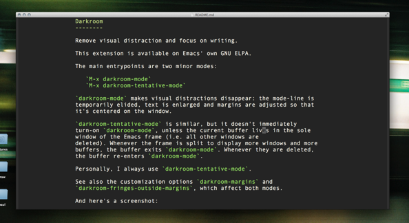

Darkroom
--------

Remove visual distractions and focus on writing.

This extension is available on Emacs' own GNU ELPA. Alternatively, put
`darkroom.el` somewhere in your load-path and `require` it.

The main entrypoints are two minor modes:

* `M-x darkroom-mode`

  `darkroom-mode` makes visual distractions disappear: the mode-line is
  temporarily elided, text is enlarged and margins are adjusted so that
  text centered on the window.
   
* `M-x darkroom-tentative-mode`

  `darkroom-tentative-mode` is similar, but it only turns on these
  features if the current buffer occupies the sole window of the
  Emacs frame (i.e. all other windows are deleted). Whenever the
  frame is split to display more windows and more buffers, the buffer
  exits `darkroom-mode`. Whenever they are deleted, the buffer
  re-enters `darkroom-mode`.

Personally, I always use `darkroom-tentative-mode`.

See also the customization options `darkroom-margins` and
`darkroom-fringes-outside-margins`, which affect both modes.

